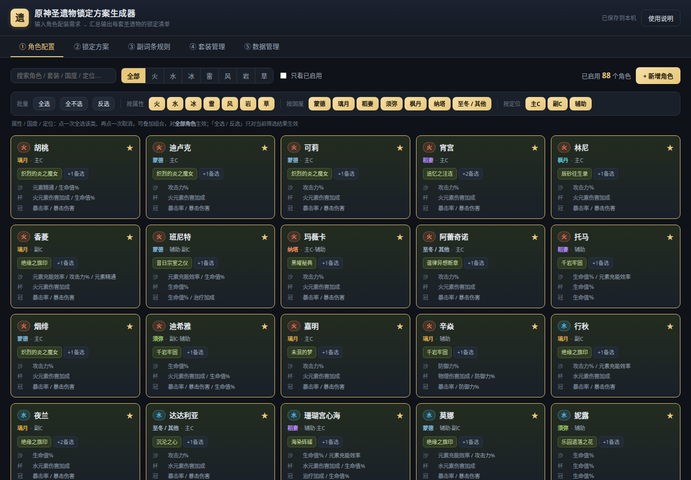
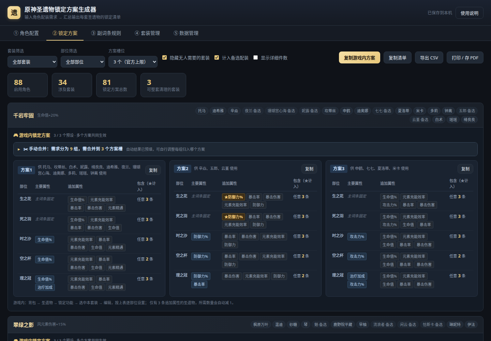
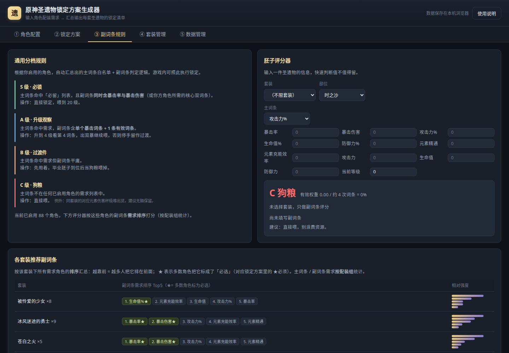
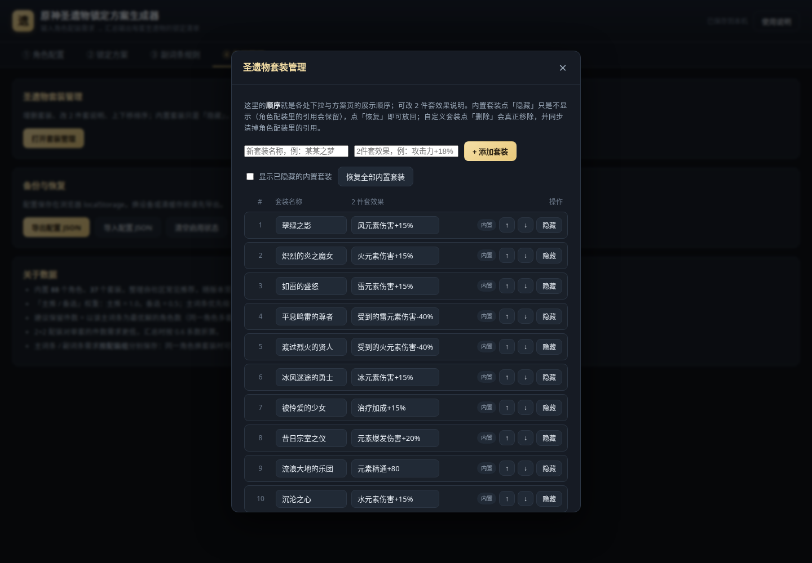
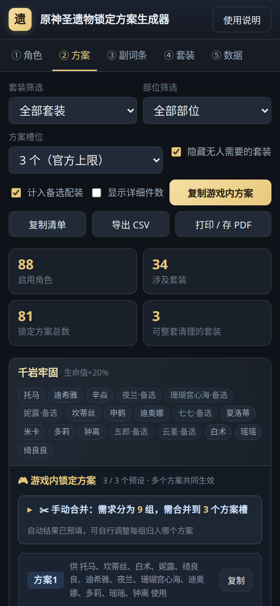

# 原神圣遗物锁定方案生成器

输入「每个角色的推荐套装 + 推荐主副词条」，自动汇总出「每个圣遗物套装该锁什么、锁几件、给谁用」。

纯前端单文件应用，**不联网、不安装**，双击 `index.html` 即用。CSS/JS 全部内联，单个文件随便拷贝、发给别人都能打开。

> **在线地址**：https://warpeas.github.io/genshin-artifact-lock/



---

## 一、项目目标

### 解决什么问题

背包里圣遗物越堆越多，但面对一件「绝缘套·充能沙」，你其实很难回答：

- 这个套装的沙漏，我该留充能沙还是攻击沙？
- 各留几件才够用？（养了 6 个角色，难道要留 6 件充能沙？）
- 哪些套装我根本用不上，可以整套喂掉？

### 核心思路

圣遗物锁定本质上是一个**三维汇总**：

```
套装 × 部位 × 主词条  →  需不需要留、留几件、给谁用
```

每个角色贡献若干条需求（配装组 + 各部位可接受的主词条 + 优先级），汇总引擎把所有启用角色的需求叠加进「套装 × 部位 × 主词条」的格子里，一次性输出完整清单。

**产出物**：每个套装 ≤3 个可直接照搬进游戏的「游戏内锁定方案」，以及（可选展开的）逐套装详细件数清单——留什么、留几件、给谁用。

---

## 二、怎么用

### 路径 A：只想用，不改数据

1. 双击根目录的 **`index.html`**
2. **① 角色配置**：勾选你实际在养的角色
   - 懒得一个个点？用批量栏：一键全选 / 反选，或按**属性**（火水冰雷风岩草）、按**国度**（蒙德/璃月/稻妻/须弥/枫丹/纳塔/至冬）、按**定位**（主C/副C/辅助）整类切换，三类可叠加
3. **② 锁定方案**：查看结果
   - 页面直接给出每个套装的**「游戏内锁定方案」**（≤3 个预设，可进游戏照搬）
   - 想看「留几件、给谁用」的详细件数，勾选工具栏「显示详细件数」展开
   - 需要存档就点「复制游戏内方案」「复制清单」或「导出 CSV」（Excel 可直接打开）
4. **③ 副词条规则**（可选）：拿不准某件胚子值不值得留，用评分器输入副词条数值直接判定

> 你的勾选和编辑保存在浏览器本地（localStorage）。换设备或清缓存前，记得去 **④ 数据管理 → 导出 JSON** 备份。

### 路径 B：要改内置数据

两种方式，按需选择：

| 方式 | 适用场景 | 影响范围 | 要不要重新构建 |
|---|---|---|---|
| **界面里改**（推荐） | 校正个别角色的配装、加个新角色 | 只存在你自己浏览器里 | 不需要 |
| **改源码** | 批量修正角色库、新增套装、改权重模型 | 影响所有拿到 `index.html` 的人 | **需要**，跑 `node build.js` |

**界面里改**：点角色卡片可编辑配装组、主词条优先级、副词条权重、国度与定位；「数据管理」页可新增自定义套装。改完点保存即可，无需碰代码。

**改源码**：改 `src/data.js` 后执行：

```bash
node build.js
```

会重新生成根目录的 `index.html`。

> ⚠️ **根目录的 `index.html` 是构建产物，不要直接编辑它** —— 下次执行 `node build.js` 会被覆盖。所有修改都请改 `src/` 里的文件。

---

## 三、目录结构

```
genshin-artifact-lock/
│
├── index.html          ★ 成品。唯一的可运行页面，双击即用 / 上传 GitHub Pages 就是这个
├── README.md           本说明
├── .nojekyll           GitHub Pages 用（跳过 Jekyll 构建），勿删
├── build.js            构建脚本：把 src/ 打包成单文件版 index.html
│
├── src/                源码。改数据、改逻辑都在这里，改完跑 node build.js
│   ├── data.js         ★ 基础共用数据：套装库、角色库、主/副词条、国度/定位
│   ├── app.js          汇总引擎与交互逻辑（权重、分级阈值在此）
│   ├── styles.css      样式（含打印样式与手机端适配）
│   └── template.html   页面骨架模板（构建时被注入 css/js，生成 index.html）
│
└── preview/            界面截图，仅用于本文档展示，可删
    ├── 01-角色配置.png
    ├── 02-锁定方案.png
    └── 03-副词条规则.png
```

> **关于「两个 index.html」**：本项目**只有根目录一个 `index.html`**。源码骨架刻意命名为 `src/template.html` 而非 `index.html`，就是为了避免同名混淆——它只是构建模板，**单独打开没有样式**（需靠同目录的 css/js），请勿直接使用。

---

## 四、维护基础共用数据：改哪里

**绝大多数维护需求都集中在 `src/data.js` 一个文件里。**

| 想改什么 | 文件 | 位置（常量名） | 说明 |
|---|---|---|---|
| **内置套装清单 / 2 件套文案** | `src/data.js` | `SETS` | 格式 `{ name, bonus }`，`SET_NAMES` 和 `SET_BONUS` 由它自动派生，**不用手改**。日常增删改名也可直接在页面「④ 套装管理」里做 |
| **改角色的配装、主词条优先级** | `src/data.js` | `RAW_CHARS` | 见下方格式说明 |
| **改角色的国度 / 队伍定位** | `src/data.js` | `CH_META` | 格式 `'角色名': [国度, [定位...]]` |
| 主词条可选范围（如新增某种杯） | `src/data.js` | `MAIN_STATS` | 按部位分组 |
| 副词条种类 | `src/data.js` | `SUB_STATS` | — |
| 副词条需求预设（双暴/精通流等） | `src/data.js` | `SUB_PRESETS` | **有序数组**，每项 `[词条id, 是否必选]`，越靠前越想要；名字见 `SUB_PRESET_NAMES` |
| 元素 / 国度 / 定位枚举 | `src/data.js` | `ELEMENTS` / `REGIONS` / `ROLES` | 新增国度或定位时改这里，批量栏按钮会自动生成 |
| 汇总权重、分级阈值、保留件数上限 | `src/app.js` | 文件顶部常量区 | 见「权重模型」一节 |
| 副词条名次权重、候选池上限、聚类阈值 | `src/app.js` | `SUB_RANK_DECAY` / `SUB_CORE_TOP` / `SUB_POOL_TOP` / `SUB_POOL_MAX` / `MERGE_SIM_TH` | 见「副词条排序模型」一节 |
| 界面样式、配色 | `src/styles.css` | — | — |

### `RAW_CHARS` 角色库格式

```js
// [ 名称, 元素, 副词条预设, builds, 沙, 杯, 冠 ]
['雷电将军', 'electro', 'er', [['绝缘之旗印']], ['er', 'atkP'], ['electro', 'atkP'], ['cr', 'cd']],
```

- **builds**：第 1 项是主推配装，其余为备选；单项含 1 个套装名 = 4 件套，含 2 个 = 2+2
- **主词条数组**：按优先级从高到低排列，**第 1 项即最优解**
- 元素取值：`pyro` / `hydro` / `cryo` / `electro` / `anemo` / `geo` / `dendro`
- 副词条预设：`crit`（双暴输出）、`critHp`、`critDef`、`em`（精通流）、`hp`、`def`、`er`（充能辅助）、`atk`、`heal`

改完后跑 `node build.js` 重新构建。构建脚本会做完整性校验（未知套装名、非法主词条会报错），数据写错会当场拦下来。

---

## 五、权重模型

得分公式：

```
得分 = 配装优先级 × 件套形态 × 主词条优先级   （跨角色累加）
```

| 维度 | 取值 | 权重 |
|---|---|---|
| 配装优先级 | 主推 / 备选 | 1.0 / 0.55 |
| 件套形态 | 4 件套 / 2+2 | 1.0 / 0.8 |
| 主词条优先级 | 第 1 / 2 / 3 顺位 | 1.0 / 0.5 / 0.25 |

### 分级阈值

| 得分 | 分级 | 含义 |
|---|---|---|
| ≥ 0.8 | **必留** | 有角色把它当最优解，至少留 1 件 |
| 0.4 – 0.8 | **过渡** | 只有次选或备选配装需要，有就用、不专门刷 |
| < 0.4 | 不显示 | 需求太弱，视为狗粮 |

### 建议保留件数

- **沙 / 杯 / 冠**：以该词条为**最优解**的角色数（同一角色多套配装不重复计数），区间 1–4
- **花 / 羽**：主词条固定，件数 = 需要该套装的角色数，区间 1–4
- **暴击率冠与暴击伤害冠自动合并**为「二选一」——它们实际可互换，分开统计会严重高估（实测可把 12+3 件修正为 7 件）

以上常量在 `src/app.js` 顶部，可按需微调。游戏内方案的聚类 / 合并常量（`MERGE_SIM_TH`、`MAIN_MAX`、`MAIN_COVER`、`SLOT_STRICT`）也在同一区域，每个常量都有注释说明用途。

### 副词条排序模型

副词条不再使用 0–1 数值权重，而是和主词条一样用**「排序 + 必选」**表达，界面上只有「上下移」和「☆/★」两个操作：

```js
// 一份副词条需求 = 有序数组，越靠前越想要；req = true 即 ★必须
[{ id: 'cr', req: true }, { id: 'cd', req: true }, { id: 'atkP', req: false }, ...]
```

内部需要一个数值量（相似度比较、胚子评分）时，按名次折算：

| 常量 | 默认值 | 含义 |
|---|---|---|
| `SUB_RANK_DECAY` | 0.72 | 第 1 名权重 1.0，之后逐名 ×0.72；标了 ★ 再 ×1.25 |
| `SUB_CORE_TOP` | 3 | 前 3 名 ∪ 所有 ★ 视为「核心需求」，决定「包含任意 N 条」的基准 |
| `SUB_POOL_TOP` | 5 | 单个角色最多贡献 5 条候选副词条 |
| `SUB_POOL_MAX` | 5 | 合并后候选池上限，再宽就等同于「不限」，失去筛选意义 |

**★必须**取的是「组内**全体**角色都标了必选」的交集（最多 2 个）——因为 ★ 在游戏内表示「没有就不锁」，只要有一个角色不需要它，设了就会漏锁该角色的件。

---

## 六、五个页面

### ① 角色配置


- 内置 88 个角色的常见配装，每个角色带「国度 + 队伍定位」标签
- 批量选择：全选 / 全不选 / 反选（作用于当前筛选结果）；按属性、国度、定位整类切换，点一次全选、再点一次取消，可自由叠加
- 搜索框支持角色名、套装名、国度、定位混合搜索
- 点卡片打开编辑抽屉，可改：配装组（4 件套 / 2+2）、**主词条排序**、**副词条排序 + ★必选**、国度与定位；支持新增自定义角色
- **词条需求按配装组分别保存**：同一角色的第 1 组和第 2 组可以有不同的主词条 / 副词条需求
- **一键复制词条**：抽屉里「📋 从…一键复制词条」下拉，可把任一配装组的主 + 副词条需求整组复制过来，也可直接套用 9 种副词条预设；新增配装组时默认就复制当前组的词条

### ② 锁定方案



页面主体就是每个套装的**「游戏内锁定方案」**，默认隐藏其他细节，所见即可照搬进游戏：

- **方案卡片**：每个套装 ≤3 个预设并排展示，逐部位列出主要属性、★必须词条、候选词条与「包含任意 N 条」
- **方案归属**：卡片标题注明「供谁使用」，同一套装的多个方案在游戏内共同生效（彼此是「或」的关系）
- **手动合并**：某套装的需求分组超过 3 个时，出现「✂️ 手动合并」面板——每个分组一行（角色 + 主属性摘要 + 归入方案 1/2/3 的下拉），自动结果已预填，可自行调整；改动保存在本地存档，「重置为自动合并」一键还原
- 单方案可单独复制；「复制游戏内方案」一键复制全部套装
- 勾选「显示详细件数」可展开每套的建议保留件数与需求来源（必留 / 过渡 / 可喂）
- 元素伤害杯自动打「稀有·建议多留」标记；支持复制清单、导出 CSV、打印 / 存 PDF

#### 游戏内锁定方案 · 生成规则

对齐游戏内「背包 → 圣遗物 → 锁定功能 → 套装锁定方案」的实际规则：

| 规则 | 说明 |
|---|---|
| 预设数量 | 每种套装**至多 3 个自定义方案**（官方上限），多个方案在锁定时共同生效 |
| 可设部位 | 时之沙 / 空之杯 / 理之冠可分别设主要属性与追加属性；生之花 / 死之羽主词条固定，只能设追加属性 |
| ★必须 | 勾选带 ★ 的追加属性，表示必须命中 |
| 包含任意 N 条 | 在候选词条中至少命中 N 条（★计入总数），N 取 1–4 |
| 3 词条圣遗物 | 仅有 3 条追加属性时，所需数量自动减 1 |
| 主副词条互斥 | 副词条不可能与同部位主词条相同，方案中已自动剔除，避免「★了永远锁不上」的无效条件 |

**固定算法（每个套装 × 每个部位独立聚合，结果可复现）**

攻略明确指出——**需求差异大的角色不宜并入同一方案，否则会「存伪」**（把别的角色用不上的圣遗物也锁进来）。但游戏内槽位只有 3 个，因此按固定步骤生成：

1. **角色分组**：提取每个角色的需求特征（沙/杯/冠主词条集合 + 副词条名次向量），把需求「几乎一致」（相似度 ≥ 0.95）的角色自动并为一组，其余保持独立——**组数不强行压到 3**
2. **归入方案槽**：
   - 组数 ≤ 3：一组一个方案，直接生成
   - 组数 > 3：出现「✂️ 手动合并」面板，列出每个分组（角色 + 主属性需求摘要），**默认按自动结果预填**（贪心归并最相似的组），你可以把任意组改归到方案 1/2/3；改动随本地存档保存，「重置为自动合并」一键还原
3. **主属性**：花/羽固定；沙/杯/冠按「票数 × 优先级」降序取到累计覆盖 ≥ 70% 为止，上限 3 个
4. **★必须**：组内**全员都勾了「必选」**的副词条，按平均名次权重降序，最多 2 个
5. **候选池**：组内任一角色前 5 条需求，剔除与已选主词条冲突的项，合并后最多保留 5 条
6. **包含任意 N 条**：`round(组内平均核心词条数 × 部位严格度系数)`，下限为 ★必须数量、上限为 `min(4, 候选池-1, 3)`；部位严格度：沙/羽 1.0、冠 0.95、杯 0.8（元素杯稀有，放宽防漏锁）

效果示例：绝缘套下香菱 / 行秋 / 雷电将军（攻击流）合并为方案一，夜兰（生命流）自动拆为方案二——两者副词条需求不同，混在一起会互相污染。

### ③ 副词条规则



- S/A/B/C 四档判定规则
- **胚子评分器**：输入套装、部位、主词条、副词条数值、当前等级，直接告诉你要不要留
- **各套装推荐副词条排序表**：越靠前 = 越多人把它排在前面；★ 表示多数角色把它标成了必选（对应锁定方案里的 ★必须）

### ④ 套装管理



套装列表的统一入口，改动立即影响所有下拉与方案页：

- **增删**：底部输入名称 + 2 件套效果即可添加自定义套装；内置套装点「隐藏」只是不显示（角色配装里的引用保留），随时可「恢复」；自定义套装点「删除」会真正移除并同步清掉角色配装里的引用
- **改名**：改完自动同步到所有角色的配装引用，会提示更新了多少处
- **改效果**：2 件套说明文案直接编辑
- **排序**：↑ / ↓ 上下移，顺序就是各处下拉与方案页的展示顺序

### ⑤ 数据管理

- 配置导出 / 导入 JSON（换设备、备份用）
- 清空启用状态、恢复内置默认库

> 旧存档（角色级 `subs` 数值权重 + `customSets`）会在加载时**自动迁移**：数值权重按大小降序转成排序（≥0.9 视为必选），`customSets` 合并进统一的 `state.sets`，不需要手动处理。

### 手机端（≤ 560px 竖屏）

| 项目 | 桌面 | 手机 |
|---|---|---|
| 页签文字 | ① 角色配置 | 缩短为「① 角色」，5 个页签一屏放下 |
| 方案卡 | 多列并排、表格 4 列 | 单列；表格转「部位 / 内容」两列块，不横向挤压 |
| 详细件数 | 部位名在左侧窄列 | 部位名改为整行标题 |
| 角色抽屉 | 宽 560px 侧滑 | 全屏，底部按钮平铺 |
| 顶栏 / 标签栏 | 固定偏移 | 顶栏高度用 CSS 变量同步，sticky 不错位 |
| 输入框 | 13px | ≥16px，iOS 聚焦不会自动放大页面 |
| 套装管理行 | 4 列表格 | 拆成两行块（名称 / 效果 / 操作） |

已适配 320 / 360 / 390 / 414 / 430px 常见机型宽度，**无横向滚动**；支持刘海屏安全区，手机横屏（矮屏）自动压缩顶栏。



---

## 七、注意事项

- 内置配装整理自社区常见推荐思路，**随版本更迭请自行校正**；个别角色定位见仁见智（如某角色算副C还是辅助），点开卡片就能改
- 数据保存在浏览器 localStorage，**清除浏览器数据会丢失**，重要配置请先导出 JSON
- 部署到 GitHub Pages 时需注意：localStorage 按**域名**隔离而非路径，同一域名下放两份本工具会互相覆盖数据

---

## 附：部署与更新

### 首次部署（GitHub Pages）

1. 新建仓库，把 `index.html`（+ 可选的 `README.md`、`.nojekyll`）上传
2. 仓库 **Settings → Pages → Build and deployment**，Source 选 `Deploy from a branch`，分支选你的默认分支（**`main` 或 `master`，以仓库实际为准**）、目录 `/ (root)`
3. 等 1–2 分钟构建完成，访问 `https://用户名.github.io/仓库名/`

只上传 `index.html` 一个文件即可正常运行，页面内不含任何外部依赖。

### 后续更新

改完 `src/` 下的文件后重新构建，再把 `index.html` 上传覆盖即可：

```bash
vim src/data.js      # 1. 改数据
node build.js        # 2. 重新生成单文件版 index.html
# 3. 把 index.html 上传覆盖仓库里的同名文件，Pages 约 1 分钟后自动更新
```
